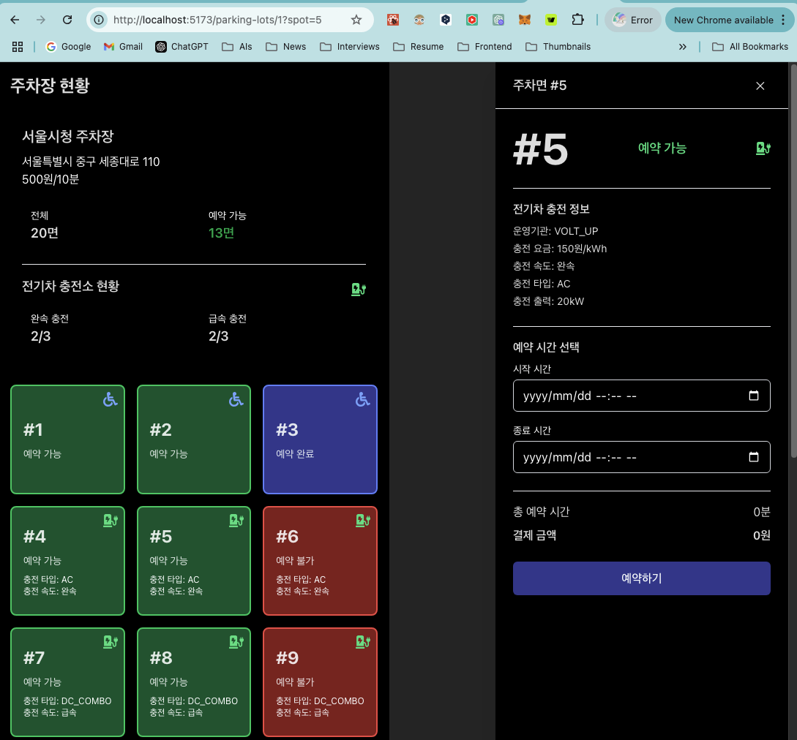

# Parking System(주차장 예약 시스템)

실시간으로 주차면 현황을 확인하고 예약할 수 있는 SPA입니다.
query string을 통해 예약 페이지 열람이 가능하도록 구현하였습니다.



## 주요 기능

- 실시간 주차면 현황 조회
- 주차면 예약 및 취소
- 전기차 충전소 정보 제공
- 장애인, 여성, 노인 전용 주차면 구분
- 예약 내역 조회

## 기술 스택


## Demo 가이드

### 필수 조건

- Node.js 18.0.0 이상
- npm 9.0.0 이상

### 프로젝트 인스톨 및 개발 서버 실행

1. `npm install`로 프로젝트 인스톨
2. `npm run dev`로 개발 서버 실행

### 주차장 id에 따른 주차장 현황 페이지

http://localhost:5173/parking-lots/1

http://localhost:5173/parking-lots/2

### 주차장 예약 및 예약 취소

http://localhost:5173/parking-lots/1

### 주차면 상세페이지 접근

http://localhost:5173/parking-lots/1?spot=5

## 프로젝트 구조

```
src/
├── api/ # API 관련 함수
├── components/ # React 컴포넌트
├── constants/ # 상수 정의
├── hooks/ # 커스텀 훅
├── mocks/ # MSW 모의 데이터 및 핸들러
├── types/ # TypeScript 타입 정의
└── utils/ # 유틸리티 함수
```

## 주요 컴포넌트

- `ParkingLot`: 전체 주차장 현황 표시
- `ParkingSpot`: 개별 주차면 컴포넌트
- `ParkingSpotSidebar`: 주차면 상세 정보 및 예약 폼
- `ReservationForm`: 예약 입력 폼
- `ReservationInfo`: 예약 정보 표시

## 재사용을 위해 추상화 된 컴포넌트

- `Sidebar`: 예약 폼 및 예약 내역 표시
- `Button`: 버튼 컴포넌트
- `Modal`: 모달 컴포넌트

## 데이터 흐름

1. MSW를 통한 모의 API 응답
2. React Query로 데이터 캐싱 및 상태 관리
3. 컴포넌트에서 데이터 표시 및 업데이트

## 개발 규칙

- 컴포넌트는 기능별로 분리
- 재사용 가능한 로직은 커스텀 훅으로 분리
- 타입 안정성을 위해 TypeScript 적극 활용
- 일관된 코드 스타일 유지

## 향후 계획

- [x] query string을 통해 예약 페이지 열람 가능하도록 구현
- [ ] 주차면 렌더링을 위해 react-window 또는 react-virtualized를 활용한 Virtual Scrolling을 도입
- [ ] 다양한 배치 형태
- [ ] 나의 예약 페이지

## 라이선스

MIT License
